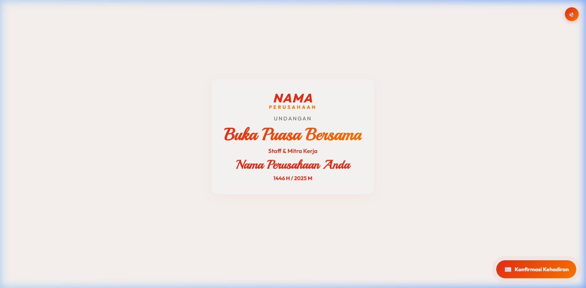
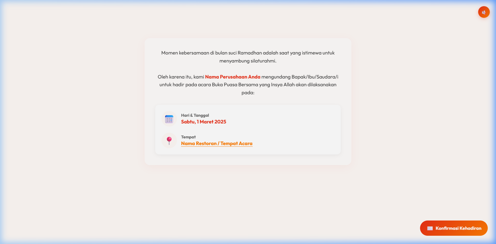
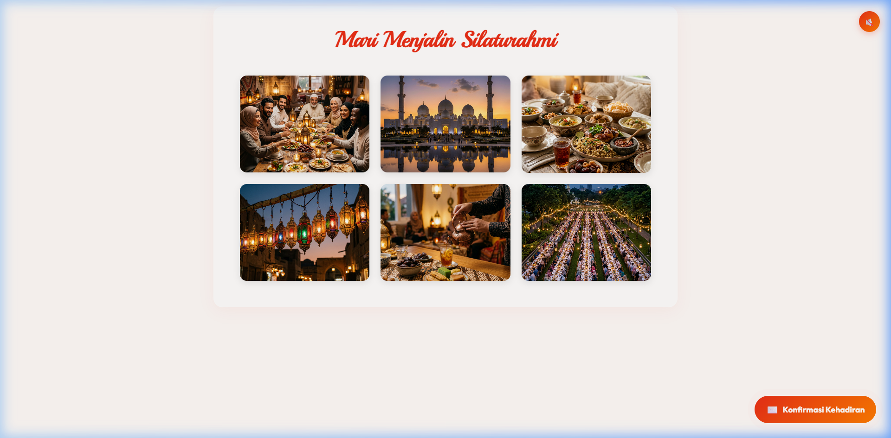
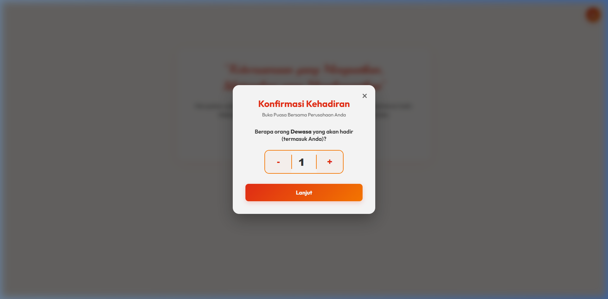

# 🌙 Undangan Digital Buka Puasa — Template

Template undangan digital modern untuk acara **Buka Puasa Bersama** (Iftar). Dibangun dengan React, TypeScript, dan Vite. Dilengkapi dengan animasi smooth scroll, galeri foto, formulir RSVP multi-step, integrasi WhatsApp, dan background music.

> **Open Source** — Template ini gratis dan dapat dimodifikasi sesuai kebutuhan Anda.

---

## ✨ Fitur Utama

| Fitur | Deskripsi |
|---|---|
| 🎨 **Desain Modern** | UI glassmorphism dengan gradient dan animasi halus |
| 📜 **Smooth Scroll** | Efek scroll halus menggunakan [Lenis](https://lenis.darkroom.engineering/) |
| 🎞️ **Animasi** | Reveal animation tiap section menggunakan [Framer Motion](https://www.framer.com/motion/) |
| 🖼️ **Galeri Foto** | Grid responsif untuk menampilkan foto-foto acara |
| 📝 **RSVP Multi-Step** | Formulir konfirmasi kehadiran bertahap (jumlah tamu → nama → pembayaran) |
| 📱 **Integrasi WhatsApp** | Pesan konfirmasi otomatis dikirim via WhatsApp |
| 📊 **Google Sheets** | (Opsional) Log data pendaftaran ke Google Sheets |
| 🎵 **Background Music** | Pemutar musik latar otomatis |
| ⏱️ **Countdown Timer** | Hitung mundur menuju batas akhir pendaftaran |
| 📱 **Responsive** | Tampilan optimal di desktop dan mobile |

---

## 📸 Preview

### 🏠 Hero Section
Tampilan pembukaan undangan dengan nama perusahaan, judul acara, dan desain glassmorphism yang elegan.



### 📅 Detail Acara
Informasi waktu dan lokasi acara dengan desain card yang bersih dan link ke Google Maps.



### 🖼️ Galeri Foto
Grid responsif menampilkan foto-foto bertema Ramadhan dan kebersamaan.



### 📝 Formulir RSVP
Modal konfirmasi kehadiran multi-step — pilih jumlah tamu, isi nama, dan konfirmasi pembayaran.



---

## 🛠️ Tech Stack

- **React 19** + **TypeScript**
- **Vite** — Build tool cepat
- **Framer Motion** — Animasi
- **Lenis** — Smooth scroll
- **Lucide React** — Ikon
- **Google Fonts** — Outfit & Playball

---

## 🚀 Quick Start

### 1. Clone Repository

```bash
git clone https://github.com/YOUR_USERNAME/ramadhan-invitation-template.git
cd ramadhan-invitation-template
```

### 2. Install Dependencies

```bash
npm install
```

### 3. Jalankan Development Server

```bash
npm run dev
```

Buka `http://localhost:5173` di browser.

### 4. Build untuk Production

```bash
npm run build
```

Hasil build ada di folder `dist/`.

---

## 📁 Struktur Proyek

```
├── public/
│   ├── pictures/           # Foto-foto untuk galeri (ganti dengan foto Anda)
│   └── audio.mp3           # Musik latar (ganti dengan audio Anda)
├── src/
│   ├── components/
│   │   ├── Hero.tsx         # Section pembuka (nama perusahaan, judul)
│   │   ├── EventDetails.tsx # Detail acara (tanggal, lokasi)
│   │   ├── Gallery.tsx      # Galeri foto
│   │   ├── RSVP.tsx         # Formulir konfirmasi kehadiran + pembayaran
│   │   ├── FAB.tsx          # Floating action button
│   │   └── AudioPlayer.tsx  # Pemutar musik latar
│   ├── App.tsx              # Komponen utama
│   ├── index.css            # Seluruh styling
│   └── main.tsx             # Entry point
├── index.html               # HTML utama
├── package.json
├── vite.config.ts
└── tsconfig.json
```

---

## 🎨 Panduan Kustomisasi

### 1. Nama Perusahaan & Judul

Edit file `src/components/Hero.tsx`:

```tsx
<h2 className="logo-text">NAMA</h2>          // ← Ganti dengan nama perusahaan
<p className="logo-subtext">PERUSAHAAN</p>    // ← Ganti dengan sub-judul
<h2 className="company-name">Nama Perusahaan Anda</h2>  // ← Nama lengkap
```

Edit juga di `src/components/EventDetails.tsx`:

```tsx
<span className="highlight">Nama Perusahaan Anda</span>
```

Dan di `index.html` pada tag `<title>`.

---

### 2. Tanggal & Lokasi Acara

Edit file `src/components/EventDetails.tsx`:

```tsx
<p>Sabtu, 1 Maret 2025</p>                    // ← Ganti tanggal
<a href="#" ...>Nama Restoran / Tempat Acara</a>  // ← Ganti nama & link tempat
```

---

### 3. Nomor WhatsApp & Rekening Bank

Edit file `src/components/RSVP.tsx` — semua konfigurasi ada di bagian atas komponen:

```tsx
const whatsappNumber = '628XXXXXXXXXX';         // ← Nomor WhatsApp (format: 62xxx)
const BIAYA_PER_ORANG = 50000;                  // ← Biaya per peserta
const DEADLINE_DATE = new Date('2025-02-27T23:59:59').getTime(); // ← Deadline
const NAMA_ACARA = 'Buka Puasa Bersama';        // ← Nama acara
const NAMA_PENYELENGGARA = 'Perusahaan Anda';   // ← Penyelenggara
const BANK_NAME = 'BCA';                        // ← Nama bank
const BANK_ACCOUNT = '0000000000';               // ← Nomor rekening
const BANK_HOLDER = 'Nama Pemilik Rekening';     // ← Pemilik rekening
```

---

### 4. Foto Galeri

1. Letakkan foto-foto Anda di folder `public/pictures/`
2. Edit array `pictures` di `src/components/Gallery.tsx`:

```tsx
const pictures = [
    "foto-anda-1.jpg",
    "foto-anda-2.jpg",
    "foto-anda-3.jpg",
    // ... tambahkan sesuai kebutuhan
];
```

> **Tips**: Gunakan format `.jpg` atau `.webp` dengan resolusi yang sudah dioptimasi agar loading cepat.

---

### 5. Background Music

Ganti file `public/audio.mp3` dengan file audio Anda sendiri. Format yang didukung: `.mp3`, `.ogg`, `.wav`.

> **Catatan**: Browser modern memblokir autoplay audio. Template ini sudah menangani hal ini — musik akan diputar setelah interaksi pengguna pertama (klik/scroll).

---

### 6. Google Sheets Integration (Opsional)

Template ini mendukung logging data pendaftaran ke Google Sheets secara otomatis.

**Langkah setup:**

1. Buat spreadsheet baru di Google Sheets
2. Buka **Extensions → Apps Script**
3. Paste script berikut:

```javascript
function doPost(e) {
  const sheet = SpreadsheetApp.getActiveSpreadsheet().getActiveSheet();
  const data = e.parameter;
  
  sheet.appendRow([
    new Date(),
    data.namaLengkap,
    data.jumlahDewasa,
    data.jumlahAnak,
    data.daftarNama,
    data.totalBiaya,
    data.metodePembayaran
  ]);
  
  return ContentService.createTextOutput("OK");
}
```

4. Deploy sebagai **Web App** (Execute as: Me, Access: Anyone)
5. Copy URL Web App dan paste ke `src/components/RSVP.tsx`:

```tsx
const GOOGLE_SCRIPT_URL = 'https://script.google.com/macros/s/YOUR_SCRIPT_ID/exec';
```

---

## 🌐 Deployment

### Netlify

1. Push ke GitHub
2. Login ke [Netlify](https://netlify.com) → **Add new site** → **Import from Git**
3. Build command: `npm run build`
4. Publish directory: `dist`

### Vercel

1. Push ke GitHub
2. Login ke [Vercel](https://vercel.com) → **New Project** → Import repository
3. Framework preset: **Vite** (auto-detected)

---

## 📄 Lisensi

Template ini dirilis di bawah [MIT License](LICENSE). Anda bebas menggunakan, memodifikasi, dan mendistribusikan template ini.

---

## 🙏 Credits

- Desain dan development oleh [@alzithetrivialmind](https://github.com/alzithetrivialmind)
- Font: [Outfit](https://fonts.google.com/specimen/Outfit) & [Playball](https://fonts.google.com/specimen/Playball) dari Google Fonts
- Smooth scroll: [Lenis](https://lenis.darkroom.engineering/)
- Animasi: [Framer Motion](https://www.framer.com/motion/)
